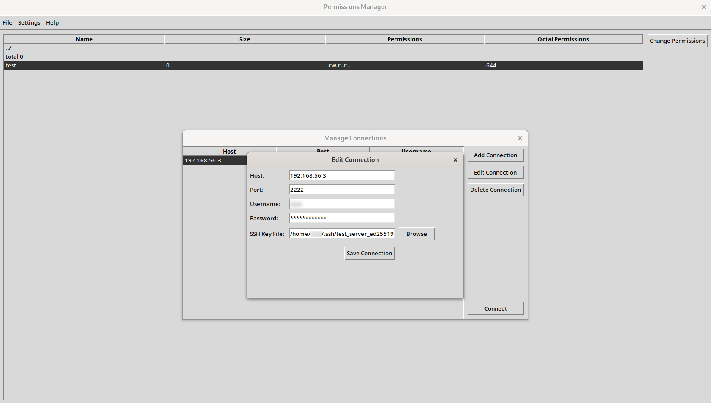
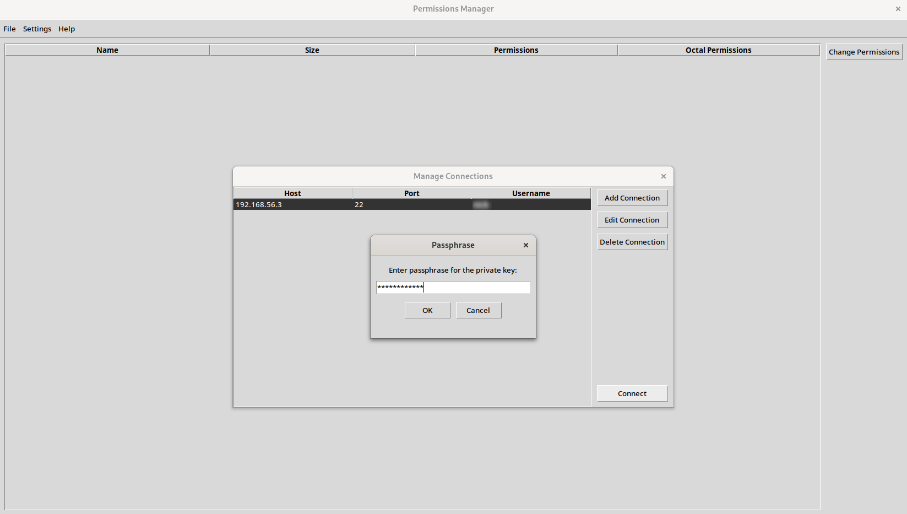
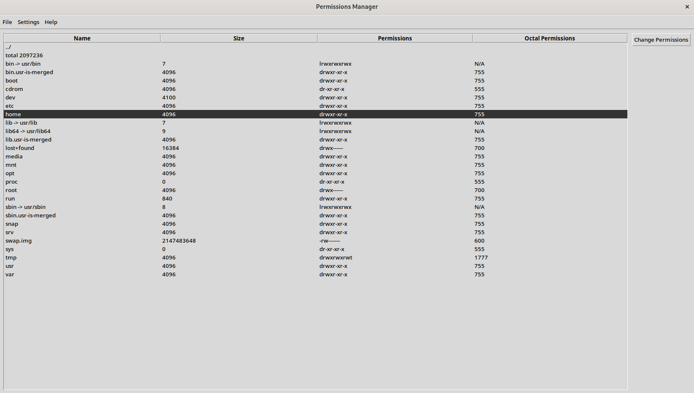
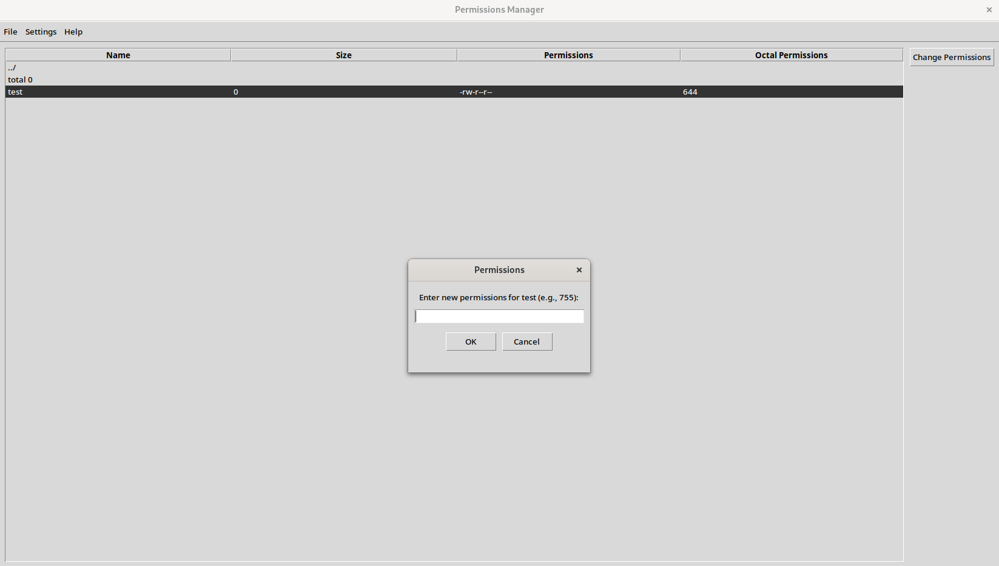

# Permissions Manager

A user-friendly, free tool designed to streamline and manage GNU/Linux file permissions effortlessly


## Build Setup

```bash
# Arch Linux
$ python -V && pip --version
$ sudo pacman -S tk git

# Ubuntu
$ python3 -V && pip3 --version
$ sudo apt install python3-tk git

# Clone repository
$ git clone git@github.com:ncklinux/PermissionsManager.git
$ cd PermissionsManager
$ git checkout -b YOUR_BRANCH_NAME

# It is always recommended to use a virtual environment, use the following commands to manage libraries with pip
$ python -m venv .venv
$ source .venv/bin/activate
$ pip install paramiko tk black mypy flake8 bandit
$ pip list

# Usage
$ python main.py
```

| Preview 01                                          | Preview 02                                          | Preview 03                                          | Preview 04                                          |
| --------------------------------------------------- | --------------------------------------------------- | --------------------------------------------------- | --------------------------------------------------- |
|  |  |  |  |

## Motivation

Introducing a powerful tool designed for the Linux user: a Tkinter application that simplifies the process of modifying file rights and permissions. In an era where data security and access control are paramount, our application empowers users to manage their files with ease and confidence. With a user-friendly interface, you can swiftly navigate through file properties, ensuring that your sensitive information remains protected while granting appropriate access where needed. Embrace the blend of simplicity and functionality, and take control of your digital environment today!

## Type Annotations

[Mypy](https://mypy-lang.org) is an optional static type checker for Python that aims to combine the benefits of dynamic (or "duck") typing and static typing. Mypy combines the expressive power and convenience of Python with a powerful type system and compile-time type checking. Mypy type checks standard Python programs; run them using any Python VM with basically no runtime overhead.

```bash
$ mypy --ignore-missing-imports main.py
# Success: no issues found in 1 source file
```

## Linting

Python linting, also known as code linting or static code analysis, is the process of analyzing Python code for potential errors, bugs, security and stylistic issues. The term "lint" comes from the idea of using a lint roller to remove tangled threads from fabric, and in this context, Python linting is like using a tool to "lint" or clean up your Python code to make it more readable, maintainable, and error-free.

- There are some linters out there, the most tried and tested is [Flake8](https://flake8.pycqa.org), "the wrapper which verifies pep8, pyflakes, and circular complexity", also has a low false positive rate.
- [Bandit](https://bandit.readthedocs.io/en/latest/) is a tool designed to find common security issues in Python code. To do this, Bandit processes each file, builds an AST from it, and runs appropriate plugins against the AST nodes. Once Bandit has finished scanning all the files, it generates a report.

## Formatting

[Black](https://pypi.org/project/black/) is the uncompromising Python code formatter. By using it, you agree to cede control over minutiae of hand-formatting. In return, Black gives you speed, determinism, and freedom from pycodestyle nagging about formatting. You will save time and mental energy for more important matters.

## Troubleshooting

If you encountered the following module error, in fact, any similar module error `No module named 'pip'`, see below for more details:

```bash
$ python main.py

# Traceback (most recent call last):
#   File ".venv/bin/pip", line 5, in <module>
#     from pip._internal.cli.main import main
# ModuleNotFoundError: No module named 'pip'
```

It turns out that Virtualenv is not up to date, use the following commands to fix the problem:

```bash
$ deactivate
$ rm -rf .venv
$ python -m venv .venv
$ source .venv/bin/activate
$ pip install ...
```

And reinstall all the PIP packages as you did at the [beginning](https://github.com/ncklinux/PermissionsManager?tab=readme-ov-file#build-setup) when you started with the program, then execute `python main.py` again, this time should work without module issues.

## License

GNU General Public License v3.0 - See the [LICENSE](https://github.com/ncklinux/PermissionsManager/blob/main/LICENSE) file in this project for details.

## Disclaimer

This project is currently under development, distributed FREE & WITHOUT ANY WARRANTY. Report any bugs or suggestions as an [issue](https://github.com/ncklinux/PermissionsManager/issues/new).

## Commit Messages

This repository follows the [Conventional Commits](https://www.conventionalcommits.org) specification, the commit message should never exceed 100 characters and must be structured as follows:

```
<type>[optional scope]: <description>

[optional body]

[optional footer(s)]
```

## Note

I will keep and maintain this project as open source forever! [Watch it](https://github.com/ncklinux/PermissionsManager/subscription), give it a :star: and follow me.

## Powered by


